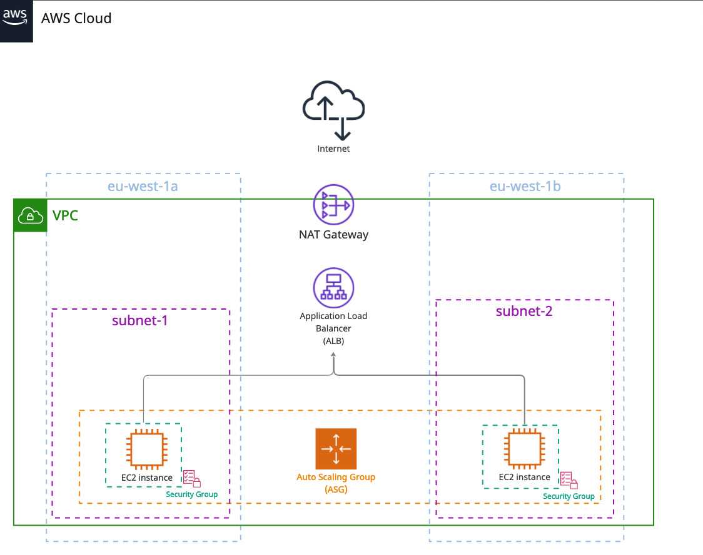

<!-- TABLE OF CONTENTS -->

  
Table of Contents

  <ol>
    <li><a href="#infrastructure-overview">Infrastructure overview</a></li>
  </ol>

## Infrastructure overview

(<a href="#readme-top">back to top</a>)

