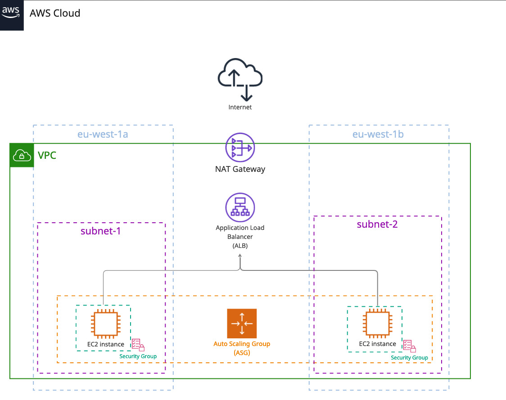

<!-- TABLE OF CONTENTS -->

  
Table of Contents

  <ol>
    <li><a href="#about-the-project">About the project</a></li>
    <li><a href="#infrastructure-overview">Infrastructure overview</a></li>
  </ol>

<!-- ABOUT THE PROJECT -->
## About the project

TBC

(<a href="#readme-top">back to top</a>)

## Infrastructure overview

(<a href="#readme-top">back to top</a>)

